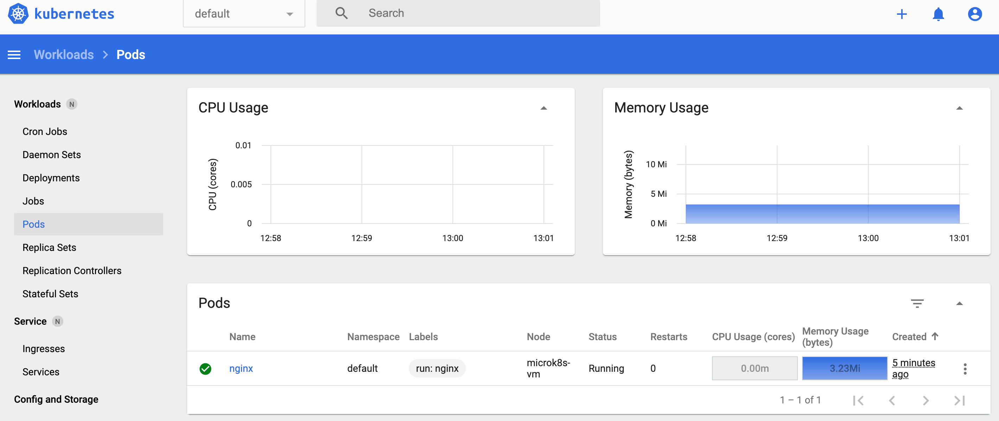

# Solución al ejercicio Nº 2 por Abel López Sánchez

## Instalación de microk8s

He elegido instalar sobre mi máquina local (Mac OS Big Sur) microk8s.

Pasos seguidos:

```
$ brew install ubuntu/microk8s/microk8s
$ microk8s install
$ microk8s start
```

## Verificación de la instalación

Tras esto, ya se puede ver que funciona:

```
$ microk8s status
microk8s is running
high-availability: no
  datastore master nodes: 127.0.0.1:19001
  datastore standby nodes: none
addons:
  enabled:
    dashboard            # The Kubernetes dashboard
    ha-cluster           # Configure high availability on the current node
    metrics-server       # K8s Metrics Server for API access to service metrics
```

También puedo comprobar el nodo:

```
$ microk8s kubectl get nodes
NAME          STATUS   ROLES    AGE   VERSION
microk8s-vm   Ready    <none>   10d   v1.22.2-3+a4bd0397e1cb5e
```

## Ejecutando pod de Nginx

```
$ microk8s kubectl run nginx --image nginx
pod/nginx created
$ microk8s kubectl get pods
NAME    READY   STATUS              RESTARTS   AGE
nginx   0/1     ContainerCreating   0          10s
$ microk8s kubectl apply -f https://raw.githubusercontent.com/kubernetes/dashboard/v2.0.0/aio/deploy/recommended.yaml
namespace/kubernetes-dashboard created
serviceaccount/kubernetes-dashboard created
service/kubernetes-dashboard created
secret/kubernetes-dashboard-certs created
secret/kubernetes-dashboard-csrf created
secret/kubernetes-dashboard-key-holder created
configmap/kubernetes-dashboard-settings created
role.rbac.authorization.k8s.io/kubernetes-dashboard created
clusterrole.rbac.authorization.k8s.io/kubernetes-dashboard unchanged
rolebinding.rbac.authorization.k8s.io/kubernetes-dashboard created
clusterrolebinding.rbac.authorization.k8s.io/kubernetes-dashboard configured
deployment.apps/kubernetes-dashboard created
service/dashboard-metrics-scraper created
Warning: spec.template.metadata.annotations[seccomp.security.alpha.kubernetes.io/pod]: deprecated since v1.19; use the "seccompProfile" field instead
deployment.apps/dashboard-metrics-scraper created
$ microk8s kubectl proxy
Starting to serve on 127.0.0.1:8001
^C
Aborted!

```

Ahora se puede ver el pod:

```
$ microk8s kubectl get pods -o wide
NAME    READY   STATUS    RESTARTS   AGE   IP            NODE          NOMINATED NODE   READINESS GATES
nginx   1/1     Running   0          92s   10.1.254.76   microk8s-vm   <none>           <none>
```

Y si ejecutamos el UI también:

```
$ microk8s dashboard-proxy
Checking if Dashboard is running.
Warning: spec.template.spec.nodeSelector[beta.kubernetes.io/os]: deprecated since v1.14; use "kubernetes.io/os" instead
Waiting for Dashboard to come up.
Dashboard will be available at https://192.168.64.3:10443
Use the following token to login:
<token>
Forwarding from 0.0.0.0:10443 -> 8443
```

Con esto, accediendo en mi local a https://192.168.64.3:10443 ya veo el UI, y en la pestaña de pods el de Nginx:



## Configuración con alta disponibilidad

Si quisiéramos tener el cluster con alta disponibilidad, tendríamos que añadir más nodos workers.

Para ello habría que ejecutar:

```
$ microk8s add-node
From the node you wish to join to this cluster, run the following:
microk8s join 192.168.64.3:25000/1dedeadfc53c44772b82d62047a971a3/1f210d4d220b

If the node you are adding is not reachable through the default interface you can use one of the following:
 microk8s join 192.168.64.3:25000/1dedeadfc53c44772b82d62047a971a3/1f210d4d220b
```

Y en cada instancia de microk8s, ejecutar:

```
$ microk8s join 192.168.64.3:25000/1dedeadfc53c44772b82d62047a971a3/1f210d4d220b
```

Esto sumaría nodos al cluster, haciendo que en caso de fallo de uno se sigan pudiendo ejecutar los pods en los demás.